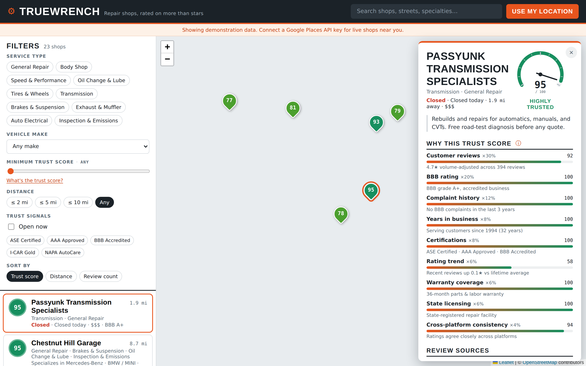

# TrueWrench

Find an auto repair shop you can actually trust — not just one with the most stars.

TrueWrench is a map-based directory of US auto repair shops. Every shop gets a **Trust Score (0–100)** that blends customer reviews with harder-to-game signals: state licensing, Better Business Bureau grade, complaint history, years in business, certifications, warranty, and rating trend. When a signal's data source isn't connected for a shop, the score says so and reweights across what's real — it never invents a number about a named business.

Live at **[truewrench.vercel.app](https://truewrench.vercel.app)**.



> **About this screenshot:** it shows the bundled **demo dataset** — hand-written Philadelphia sample shops with illustrative BBB, warranty, and certification values, flagged by the banner at the top. Against the live database, most of those breakdown rows currently read "Data source not connected" (see [What's unfinished](#whats-unfinished)). Map tiles are blank because the capture ran in a sandbox without tile access.

## What it does

- **Search by area** — radius search around any point, "Use my location," and a "Search this area" button when you pan away
- **Filter** by service type (body, tires, oil, transmission, brakes, exhaust, electrical, inspection, performance), minimum trust score, distance, open now, certifications, and **vehicle make** (grouped into families like Honda/Acura or Audi/VW/Porsche — specialists rank first, generalists stay in)
- **Rank** by trust score, distance, or review volume
- **Explain** — every shop's detail panel shows each signal, its weight, its inputs, and whether its source is connected. "What's the trust score?" opens an in-page explainer.

## The Trust Score

Star ratings are gameable and incomplete. The composite in [`src/lib/trustScore.ts`](src/lib/trustScore.ts) blends nine independent signals, each normalized to 0–100:

| Signal | Weight | What it measures |
| --- | --- | --- |
| Customer reviews | 30% | Volume-adjusted average across platforms. Bayesian shrinkage toward a 3.6★ prior with 25 pseudo-reviews, so a 5.0 from 4 reviews can't beat a 4.7 from 900. |
| BBB rating | 20% | Letter grade A+ (100) through F (0); "not rated" is neutral (50); +5 for accreditation |
| Complaint history | 12% | BBB complaints relative to review volume, and resolution rate |
| Years in business | 8% | Longevity as a proxy for repeat customers |
| Certifications | 8% | ASE, AAA Approved, I-CAR Gold, NAPA AutoCare, BBB accreditation |
| Rating trend | 6% | Recent ~12-month average vs lifetime — catches decline under new ownership |
| Warranty coverage | 6% | Length of the posted parts & labor warranty |
| State licensing | 6% | Registered repair facility with the state |
| Cross-platform consistency | 4% | Whether ratings agree across platforms; big spreads suggest manipulation |

**The honesty rule.** Each signal is nullable. A `null` means "this source isn't connected for this shop," and the signal is dropped from the composite with `available: false`. The remaining signals are reweighted to sum to 100%:

```ts
const available = breakdown.filter((e) => e.available)
const totalWeight = available.reduce((s, e) => s + e.weight, 0)
if (totalWeight === 0) return { composite: 0, tier: 'unrated', breakdown }
const composite = Math.round(
  available.reduce((s, e) => s + e.score * e.weight, 0) / totalWeight,
)
```

A shop with no connected signals shows as gray **"Not yet rated"** rather than being scored on invented data. The engine is source-agnostic — new data feeds just fill in `TrustSignals` fields in [`src/types.ts`](src/types.ts).

## Data architecture

Discovery is self-hosted; paid APIs are enrichment only. This is what keeps costs flat at scale (per-search Google Places calls would run thousands of dollars a month at modest traffic).

```
Browser ──► /api/shops ──► 1. Supabase/PostGIS (Overture Maps data)   free per query
                           2. Google Places proxy                     fallback only
                           3. 503 → client shows bundled demo data
        ──► /api/enrich ─► Google rating for ONE shop, on detail-open, cached 30 days
```

### PostGIS radius search

The `shops` table holds ~334,000 US auto-repair businesses extracted from [Overture Maps](https://overturemaps.org/) places data (CDLA-Permissive licensed; Overture's stable GERS ids survive monthly refreshes). Location is a generated `geography` column with a GIST index:

```sql
geog geography(point, 4326) generated always as
  (st_setsrid(st_makepoint(lng, lat), 4326)::geography) stored;
create index shops_geog_gist on public.shops using gist (geog);
```

Searches call one SQL function, `shops_within(lat, lng, radius_m)`, which filters with `ST_DWithin` (index-backed), orders by the `<->` distance operator, joins `trust_signals`, and returns the 50 nearest:

```sql
select s.*, ts.state_licensed, ts.bbb_grade, ...
from public.shops s
left join public.trust_signals ts on ts.shop_id = s.id
where st_dwithin(s.geog, st_setsrid(st_makepoint(in_lng, in_lat), 4326)::geography, radius_m)
order by s.geog <-> st_setsrid(st_makepoint(in_lng, in_lat), 4326)::geography
limit 50;
```

Row Level Security is enabled on every table with **no policies** — the anon key can't read anything. Only the serverless functions, holding the service-role key, can query.

### Tables

| Table | Holds | State |
| --- | --- | --- |
| `shops` | Overture discovery data: name, categories, address, phone, hours, specialties, location | Populated (~334k rows) |
| `trust_signals` | Per-shop licensing/BBB/complaint columns | `state_licensed` populated for NY + CA (~17.8k shops); BBB and complaint columns exist but are empty |
| `enrichment` | Cached Google rating + count per shop, 30-day TTL, negative results included | Empty until a Google key is configured |

### Pipelines (GitHub Actions)

- **`ingest-overture.yml`** — monthly. DuckDB reads Overture's places GeoParquet from public S3; [`scripts/ingest_overture.py`](scripts/ingest_overture.py) filters US auto-repair categories, maps them to the app's taxonomy, drops noise (towing, car washes, salvage, mis-geocoded foreign listings), and `psql` upserts the CSV.
- **`import-licensing.yml`** — quarterly. Matches official state repair-shop registries against `shops` and marks `state_licensed = true`. Matching is conservative (ZIP + fuzzy business name, [`scripts/import_licensing.py`](scripts/import_licensing.py)); only positive matches are written, because a failed fuzzy match is not evidence a shop is unlicensed. Coverage and how to add states: [`data/licensing/README.md`](data/licensing/README.md).
  - **New York** — auto-downloaded from the DMV open dataset
  - **California** — auto-downloaded from the DCA licensee lists (~44k Automotive Repair Dealers)
  - **Florida, Michigan** — drop-in slots awaiting public-records files
  - **Connecticut** — wired, but the state's published dataset is a stub
  - **Colorado, Texas** — no statewide repair-shop license exists

## Run it locally

```bash
npm install
npm run dev            # http://localhost:5173 — demo data only (no serverless functions)
npm run build          # type-check + production build to dist/
npm run typecheck:api  # type-check the serverless functions in api/
```

`npm run dev` is plain Vite, so `/api/*` doesn't exist and the app shows the bundled demo dataset with a banner. To run the real data path, use `vercel dev` with a local `.env` (git-ignored) containing:

| Variable | Purpose |
| --- | --- |
| `SUPABASE_URL` | Supabase project URL |
| `SUPABASE_SERVICE_ROLE_KEY` | Service-role key — server-side only, never shipped to the browser |
| `GOOGLE_PLACES_API_KEY` | Optional. Enables per-shop rating enrichment and the discovery fallback |

The GitHub Actions pipelines need one repo secret, `SUPABASE_DB_URL` (a Postgres connection string). Nothing secret is committed anywhere in this repo.

To seed a fresh database without running the full ingest, [`scripts/load_seed_from_url.sql`](scripts/load_seed_from_url.sql) loads the committed Philadelphia extract ([`public/seed/philly_shops.json`](public/seed/philly_shops.json), 1,976 real shops).

### Serverless gotcha

Vercel runs `api/*.ts` as native Node ES modules. Relative imports **must** carry a `.js` extension (`import { x } from './_supabase.js'`) — extensionless imports pass `tsc` and Vite but fail at runtime with `ERR_MODULE_NOT_FOUND`.

## What's unfinished

Being straightforward about where this stands:

- **Most trust signals have no live source yet.** For real (Overture) shops, only *state licensing* is connected, and only for NY and CA. BBB grade, complaints, certifications, warranty, and rating trend are all `null` for every real shop — they render as "Data source not connected." That means a real shop's score is currently driven by licensing alone, or shows "Not yet rated." The BBB has no public API; that signal needs a partner or licensed data feed.
- **Google ratings enrichment is built but unexercised in production.** The `enrichment` table is empty; the on-demand path runs only once `GOOGLE_PLACES_API_KEY` is set.
- **The demo dataset is fabricated.** `src/data/shops.ts` and `src/data/generator.ts` produce illustrative shops with made-up signals for areas without real data. They exist so the map never breaks — they are not real businesses and are always shown behind the "demonstration data" banner.
- **No shop-owner side.** There are no accounts, no auth, no "claim your listing" flow, and no first-party reviews.
- **No per-shop URLs.** The app is a single route; shop detail is a side panel, not a shareable or indexable page.
- **Map tiles** come from OpenStreetMap's public servers, which aren't meant for heavy production traffic. Switch to Protomaps/PMTiles or MapTiler before real scale.

## Stack

React 19 · TypeScript · Vite · Leaflet / react-leaflet · OpenStreetMap · Vercel serverless functions · Supabase (Postgres + PostGIS) · Overture Maps · Google Places API (New) · DuckDB · GitHub Actions
